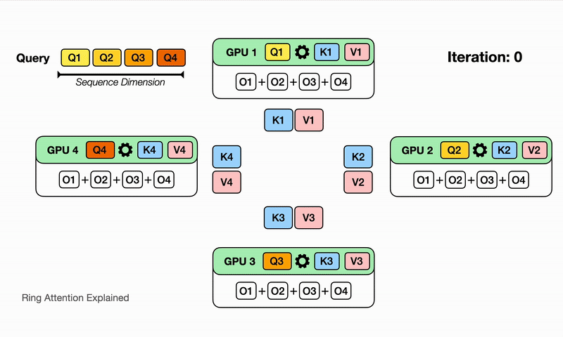
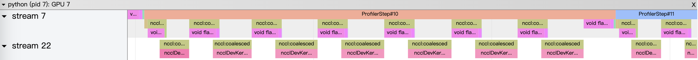
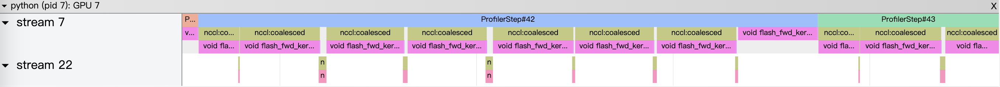
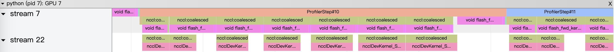
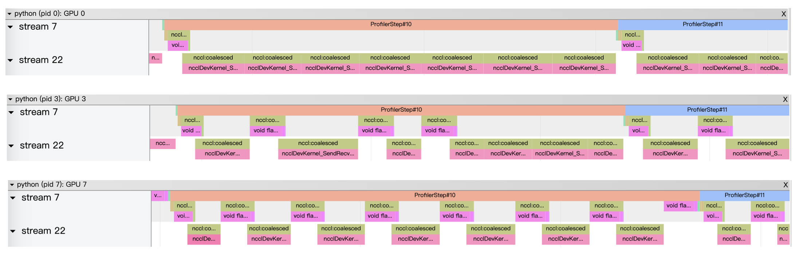
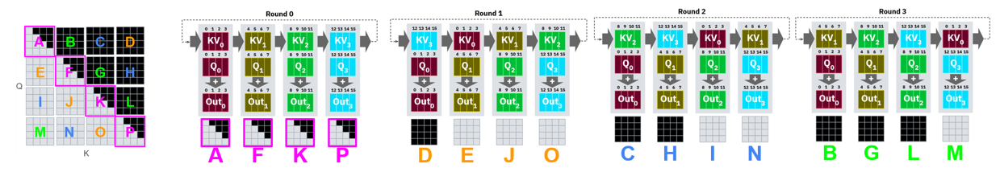
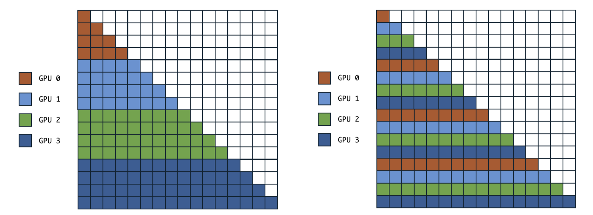
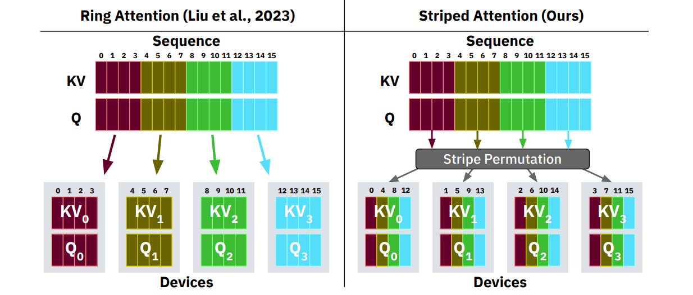
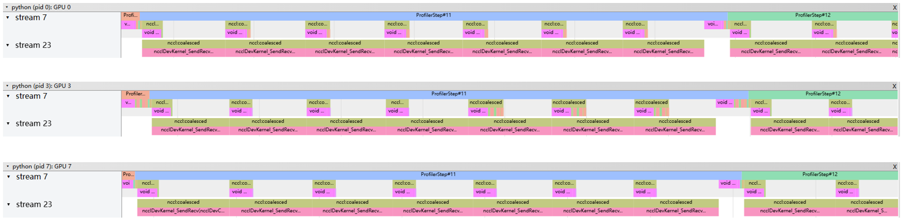

# Ring Flash Attention 研究与实现

## 1. Softmax 及其分段计算
关于 softmax 及 online softmax 的原理、计算方法，可参考笔者之前的文章：
- [ops(2)：SoftMax算子的 CUDA 实现](https://zhuanlan.zhihu.com/p/695307283)
- [LLM（十七）：从 FlashAttention 到 PagedAttention, 如何进一步优化 Attention 性能](https://zhuanlan.zhihu.com/p/638468472)

softmax 分段计算对于 Attention 的实现至关重要，其过程可参见视频 https://x.com/fvsmassa/status/1580229170629849089 .

值得一提的是，在 Flash Attention 的实现中，分段计算是在时间维度进行的，即对每个时间步的 softmax 进行分段计算，以时间换空间。而在 Ring Attention 中，分段计算是在空间维度进行的，即对每个 token 序列的 softmax 在多个device进行分段计算，以空间换时间。

现在我们引入一个新的概念：lse(log sum exp), 即 log(sum(exp(x))) 来推导分段计算的公式。
我们知道为了避免数值溢出，我们计算 softmax 时会减去一个最大值，即 

$$M=max(x)$$

$$softmax(x_i) = \frac{e^{x_i - M}}{\sum_{i=1}^{n} e^{x_i - M}}$$

然后我们引入 lse 技巧

$$lse\left(x_1, x_2, \ldots, x_n\right)=\log \left(\sum_{i=1}^n e^{x_i}\right)=M+\log \left(\sum_{i=1}^n e^{x_i-M}\right)$$

这样就有：
$$softmax(x_i) = e^{x_i-lse} $$
通过这种方式，同时解决了上溢出和下溢出的问题。

logsumexp函数还有一个有趣的性质，对其求导也可以的softmax函数
$$
\frac{\partial}{\partial x_i}\left(\log \left(\sum_{i=1}^n e^{ x_i}\right)\right)=\frac{e^{x_i}}{\sum_{i=1}^n e^{ x_i}}
$$

接下来研究如何进行分段计算，假设对于向量$X$, 将其分为 $n$ 段，即

$$X = [X_1, X_2, \ldots, X_n]$$

然后我们要采用迭代的方法计算 $softmax(X)$, 
对于第一块 $X_1$, 我们只有该部分的信息，因此只能计算该部分的 softmax, 即

$$lse_1 = \log \left(\sum_{i=1}^{len(X_1)} e^{x_i}\right)$$

$$softmax_1(x_i) = e^{x_i-lse_1}$$

然后我们再计算第二块 $lse_2$, 此时应对 $softmax_1$ 进行更新，即

$$ softmax_1^{\prime}(x_i) = \frac{e^{x_i}}{\sum_{i=1}^{len(X_1)} e^{x_i} + \sum_{i=1}^{len(X_2)} e^{x_i}} = \frac{e^{x_i}}{e^{lse_1} + e^{lse_2}} = \frac{e^{x_i}}{e^{lse_1}} \frac{e^{lse_1}}{e^{lse_1} + e^{lse_2}} = softmax_1\frac{1}{1+ e^{lse_2-lse_1}} = softmax_1*sigmoid(lse_1-lse_2)$$

这样我们就找到了递推关系，在实际的计算中，我们只需要保存当前的“全局” $lse$ 和 $softmax$ 值即可

$$lse_{new} = \log (e^{lse} + e^{lse_{block}})$$
$$softmax^\prime = softmax * e^{lse-lse_{new}}$$

## 2. Ring Attention 原理
弄清楚 softmax 的分段计算的过程之后，我们就可以开始研究 Ring Attention 的原理了。

如果我们将 Q 进行拆分，那么需要全部的 K,V 才能实现 softmax 的计算，即：

$$\text{attention}(q_x,K,V)=\frac{\sum_{y=1}^{\text{seqlen}}e^{w_{xy}}v_y}{\sum_{y=1}^{\text{seqlen}}e^{w_{xy}}}$$

其中 $w_{xy}=q_xk_y^T/\sqrt{d}$ 。

计算过程如下图所示：


接下来再对 K,V 进行拆分，我们用 $attn=A/B$ 表示 attention 结果的分子和分母, 对于分子部分，有

$$
\begin{equation}
\begin{aligned}
A_i &= \exp \left(Q_i K^T\right) \cdot V \\
&=\exp \left(\left[Q_i K_1^T, \ldots, Q_i K_{B_{K V}}^T\right]\right) \cdot V \\
&=\left(\left[\exp \left(Q_i K_1^T\right), \ldots, \exp \left(Q_i K_{B_{K V}}^T\right)\right]\right) \cdot V \\
&=\left[\exp \left(Q_i K_1^T\right), \ldots, \exp \left(Q_i K_{B_{K V}}^T\right) \right] \cdot\left[\begin{array}{c}
V_1 \\
\ldots \\
V_{B_{K V}}
\end{array}\right] \\
&=\sum_{j=1}^{B_{K V}} \exp \left(Q_i K_j^T\right) \cdot V_j
\end{aligned}
\end{equation}
$$

则有

$$
\begin{equation}
\frac{A}{B}=\frac{\sum_{i=1}^n A_i}{\sum_{i=1}^n B_i}
\end{equation}
$$

下面通过记录 $attn_i=A_i/B_i$ 和 $B_i$ 来计算完整的 attention 结果。

$$
\begin{aligned} 
B_{12} = B_1 + B_2 \\ 
attn_{12} = attn_1\frac{B_{1}}{B_{12}}+attn_2\frac{B_{2}}{B_{12}} \\ 
B_{123} = B_{12} + B_{3} \\ 
attn_{123} = attn_{12}\frac{B_{12}}{B_{123}}+attn_3\frac{B_{3}}{B_{123}} \cdots B_{1\dots n}&=B_{1\dots n-1} + B_{n} \\ 
attn=attn_{1\dots n} = attn_{1\dots n-1}\frac{B_{1\dots n-1}}{B_{1\dots n}}+attn_n\frac{B_{n}}{B_{1\dots n}} 
\end{aligned}
$$

接下来用 LSE 来替换 B，即 $LSE_i=log(B_i)$，则

$$
\begin{aligned}
LSE_{12} &= \log (B_1 + B_2) \\
&= \log(B_1 \times (1 + \frac{B_2}{B_1})) \\
&= \log B_1 + \log(1 + e^{\log B_2 - \log B_1}) \\
&= LSE_1 + \log(1 + e^{LSE_2 - LSE_1})
\end{aligned}
$$


$$
\begin{aligned} 
attn_{12} &= attn_1\frac{B_{1}}{B_{12}}+attn_2\frac{B_{2}}{B_{12}}\\ 
&=attn_1 e^{LSE_{1} - LSE_{12}}+attn_2 e^{LSE_{2} - LSE_{12}} 
\end{aligned}
$$


代码实现如下所示：
```
def _update_out_and_lse(
    out: torch.Tensor,
    lse: torch.Tensor,
    block_out: torch.Tensor,
    block_lse: torch.Tensor,
) -> Tuple[torch.Tensor, torch.Tensor]:
    block_out = block_out.to(torch.float32)
    block_lse = block_lse.transpose(-2, -1).unsqueeze(dim=-1)

    new_lse = lse + torch.log(1 + torch.exp(block_lse - lse))
    out = torch.exp(lse - new_lse) * out + torch.exp(block_lse - new_lse) * block_out

    lse = new_lse
    return out, lse
```

事实上还可以进一步简化，即不需要计算出 `new_lse`, 而改用 `sigmoid` 实现推导如下：

$$
\begin{aligned} 
attn_{12} &= attn_1 \cdot e^{LSE_{1} - LSE_{12}} + attn_2 \cdot e^{LSE_{2} - LSE_{12}} \\
&= attn_1 \cdot e^{-\log(1 + e^{LSE_{2} - LSE_{1}})} + attn_2 \cdot e^{LSE_{2} - LSE_{1} - \log(1 + e^{LSE_{2} - LSE_{1}})} \\
&= attn_1 \cdot \frac{1}{1 + e^{LSE_{2} - LSE_{1}}} + attn_2 \cdot \frac{e^{LSE_{2} - LSE_{1}}}{1 + e^{LSE_{2} - LSE_{1}}} \\
&= attn_1 \cdot \frac{1}{1 + e^{LSE_{2} - LSE_{1}}} + attn_2 \cdot \frac{1}{1 + e^{-LSE_{2} + LSE_{1}}} \\
&= attn_1 \cdot {sigmoid}(LSE_{2} - LSE_{1}) + attn_2 \cdot {sigmoid}(LSE_{1} - LSE_{2}) \\
&= attn_1 - (attn_1 - attn_2) \cdot {sigmoid}(LSE_{1} - LSE_{2})
\end{aligned}
$$

代码实现如下：
```python
def _update_out_and_lse(out: torch.Tensor, lse: torch.Tensor, block_out: torch.Tensor, block_lse: torch.Tensor,) -> Tuple[torch.Tensor, torch.Tensor]:
    block_out = block_out.to(torch.float32)
    block_lse = block_lse.transpose(-2, -1).unsqueeze(dim=-1)

    out = out - F.sigmoid(block_lse - lse) * (out - block_out)
    lse = lse - F.logsigmoid(lse - block_lse)
    return out, lse
```


## 2. Ring Attention 的实现及其细节

在上一节中，我们比较细致研究了 Ring Attention 的分块计算的过程，即：
- 将 Q,K, V 分块，其中 Q 在外循环，K, V 在内循环
- 每一块在不同 device 上分别计算分别计算 attention 和 LSE (可以服用 Flash Attention 的 kernel) 
- 将计算结果通过迭代的形式更新，得到最终的 attention 和 LSE

如下图展示了内循环的数据交互和计算过程：



前向过程的代码实现的逻辑如下：
```python
def ring_flash_attn_forward(
    process_group,
    q: torch.Tensor,
    k: torch.Tensor,
    v: torch.Tensor,
    softmax_scale,
    dropout_p=0,
    causal=True,
    window_size=(-1, -1),
    alibi_slopes=None,
    deterministic=False,
):
    comm = RingComm(process_group)

    out = None
    lse = None

    next_k, next_v = None, None

    for step in range(comm.world_size):
        if step + 1 != comm.world_size:
            next_k: torch.Tensor = comm.send_recv(k)
            next_v: torch.Tensor = comm.send_recv(v)
            comm.commit()

        if not causal or step <= comm.rank:
            params = get_default_args(_flash_attn_forward).copy()
            params.update(
                {
                    "q": q,
                    "k": k,
                    "v": v,
                    "dropout_p": dropout_p,
                    "softmax_scale": softmax_scale,
                    "causal": causal and step == 0,
                    "window_size": window_size,
                    "alibi_slopes": alibi_slopes,
                    "return_softmax": True and dropout_p > 0,
                }
            )
            block_out, _, _, _, _, block_lse, _, _ = _flash_attn_forward(**params)
            out, lse = update_out_and_lse(out, lse, block_out, block_lse)

        if step + 1 != comm.world_size:
            comm.wait()
            k = next_k
            v = next_v

    out = out.to(q.dtype)
    lse = lse.squeeze(dim=-1).transpose(1, 2)
    return out, lse
```

### 精度验证
通过运行以下代码可以验证 ring flash attention 的精度, benchmark 为已经验证过的 flash attention 的kernel
```
torchrun --nproc_per_node=8  ring_flash_attention/test_ring_flash_attn.py 
```
前向过程的误差如下：
```
##############################
# forward:
##############################
out diff:
Rank[0] max 0.00391, mean 7.68e-05
Rank[1] max 0.00195, mean 0.000114
Rank[2] max 0.000977, mean 9.16e-05
Rank[3] max 0.000977, mean 7.96e-05
Rank[4] max 0.000977, mean 7.1e-05
Rank[5] max 0.000977, mean 6.48e-05
Rank[6] max 0.000977, mean 6.01e-05
Rank[7] max 0.000488, mean 5.63e-05
lse diff:
Rank[0] max 9.54e-07, mean 1.2e-07
Rank[1] max 9.54e-07, mean 2.01e-07
Rank[2] max 9.54e-07, mean 2.27e-07
Rank[3] max 9.54e-07, mean 2.37e-07
Rank[4] max 1.91e-06, mean 2.52e-07
Rank[5] max 1.91e-06, mean 3.13e-07
Rank[6] max 1.91e-06, mean 3.38e-07
Rank[7] max 1.91e-06, mean 3.89e-07
```

反向过程的误差如下：
```
##############################
# backward:
##############################
Rank[0] max 0.0312, mean 0.000736
Rank[1] max 0.00195, mean 9.49e-05
Rank[2] max 0.000488, mean 6.39e-05
Rank[3] max 0.000977, mean 5.46e-05
Rank[4] max 0.000488, mean 4.32e-05
Rank[5] max 0.000488, mean 3.17e-05
Rank[6] max 0.000488, mean 2.94e-05
Rank[7] max 0.000488, mean 1.39e-05
dk diff:
Rank[0] max 0.0156, mean 0.000561
Rank[1] max 0.000977, mean 8.44e-05
Rank[2] max 0.000977, mean 6.15e-05
Rank[3] max 0.000488, mean 5.15e-05
Rank[4] max 0.000488, mean 3.79e-05
Rank[5] max 0.000488, mean 3.58e-05
Rank[6] max 0.000488, mean 2.96e-05
Rank[7] max 0.000488, mean 1.49e-05
dv diff:
Rank[0] max 0.0156, mean 0.000568
Rank[1] max 0.00195, mean 9.63e-05
Rank[2] max 0.000977, mean 5.6e-05
Rank[3] max 0.000977, mean 4.77e-05
Rank[4] max 0.000977, mean 4.48e-05
Rank[5] max 0.000488, mean 3.24e-05
Rank[6] max 0.000488, mean 2.87e-05
Rank[7] max 0.000488, mean 1.53e-05
```

### 性能验证
在进行评估之前，先做一下理论上的分析是必要的。对于每个 head, 分别分析其计算量与通信量，假设输入序列长度为 $N$，分到每个head的序列长度为$n$, 每个 head 维度为 $d$，则：

- 计算量（仅计算矩阵乘）：(Q \* K.T)$2n^2d$ + (S \* V)$2n^2d$ = $4n^2d$ FLOPs
- 通信量 (bf/fp16): (K)$2nb$+(V)$2nd$ = $4nd$ bytes
- 显存占用：(current QKV)$3nd$+(received KV)$2nd$+(activation)$nd$ = $6nd$ bytes

这样我们就能计算出计算访存比：$4n^2d/4nd = n$，我们可以列举出典型GPU的计算访存比

| GPU | bf16 算力(TFLOPS)| 带宽(TB/s) | 计算访存比(FLOPS/Byte) |
| --- | --- | --- | --- |
| A100 | 624 | 2.039 | 306 |
| 4090 | 330 | 1.008 | 329 |
| H100 | 1979 | 3.35 | 591 |

这样当 $n$ 大于 GPU 的设计计算访存比时，计算会成为瓶颈，此时可以设法将通信时间 overlap 掉。我们可以通过一个例子来感受这种差距

下图为总长 4096*8 的序列，分到 8 个 device 上进行 ring attention 计算的 profile 图像，可以看到计算时间小于通信时间，因此通信时间成为了瓶颈



而如果将总长度增加到 65536*8，则计算时间远小于通信时间，此时计算成为了瓶颈



那么 overlap 应该如何实现呢？在 GPU 中，设置 CUDA_DEVICE_MAX_CONNECTIONS=1，可以使NCCL通信在矩阵乘法运算（GEMM）之前被调度，以实现两者的重叠执行，提高整体性能。下图是序列长度 8192*8， CUDA_DEVICE_MAX_CONNECTIONS=1 的 profile 图像，可以看到通信时间已经被计算时间掩盖



接下来，我们记录一下这种方式下的性能数据（8*4090）
| batch_size | seq_len | nheads | head_size | fwd_only | throughput(iters/s) | latency(ms/iter) | peak memory(MB/device) | speed(TFLOPS) |
| :----: | :----: | :----: | :----: | :----: | :----: | :----: | :----: | :----: |
| 2 | 4096 | 16 | 128 | True | 158.892 | 6.294 | 228.1 | 21.8 |
| 2 | 8192 | 16 | 128 | True | 98.868 | 10.115 | 456.1 | 54.3 |
| 2 | 16384 | 16 | 128 | True | 31.829 | 31.418 | 912.2 | 69.9 |
| 2 | 32768 | 16 | 128 | True | 10.862 |92.067 | 1824.5 | 95.5 |
| 2 | 65536 | 16 | 128 | True | 4.799 | 208.391 | 3649 | 168.8 |
| 2 | 128000 | 16 | 128 | True | 2.626 | 380.743 | 7139.9 | 352.5 |
| 2 | 4096 | 16 | 128 | False | 45.368 | 22.042 | 240 | 21.8 |
| 2 | 8192 | 16 | 128 | False | 21.449 | 46.622 | 480 | 41.2 |
| 2 | 16384 | 16 | 128 | False | 5.047 | 198.147 | 960.2 | 38.8 |
| 2 | 32768 | 16 | 128 | False | 2.116 | 472.596 | 1920.5 | 65.1 |
| 2 | 65536 | 16 | 128 | False | 1.338 | 747.572 |  3841 | 164.7 |
| 2 | 128000 | 16 | 128 | False | 0.708 | 1412.227 | 7515.9 | 332.6 |

以下是（8*H100）的性能数据

| batch_size | seq_len | nheads | head_size | fwd_only | throughput(iters/s) | latency(ms/iter) | peak memory(MB/device) | speed(TFLOPS) |
| :----: | :----: | :----: | :----: | :----: | :----: | :----: | :----: | :----: |
| 2 | 4096 | 16 | 128 | True | 102.454 | 9.761 | 800 | 14.1 |
| 2 | 8192 | 16 | 128 | True | 36.798 | 27.176 | 1601 | 20.2 |
| 2 | 16384 | 16 | 128 | True | 9.066 | 110.306 | 3202 | 19.9 |
| 2 | 32768 | 16 | 128 | True | 2.424 | 412.597 | 6404 | 21.3 |
| 2 | 65536 | 16 | 128 | True | 0.643 | 1556.282 | 12808 | 22.6 |
| 2 | 128000 | 16 | 128 | True | 0.168 | 5983.8 | 25616 | 22.6 |
| 2 | 4096 | 16 | 128 | False | 45.368 | 22.042 | 240 | 21.8 |
| 2 | 8192 | 16 | 128 | False | 7.467 | 133.928 | 1601 | 14.367 |
| 2 | 16384 | 16 | 128 | False | 1.865 | 536.319 | 3202 | 14.3 |
| 2 | 32768 | 16 | 128 | False | 0.592 | 1689.044 | 6404 | 18.2 |
| 2 | 65536 | 16 | 128 | False | 0.159 | 6274.218 | 12808 | 19.6 |

可以看出这样的计算效率并不高，这是因为计算的不均衡，下面我们来做进一步的分析。

首先将不同 GPU 上的 profile 在一起比较，下图显示了 GPU 0,3,7 的 profile 的对边，可以看到其计算和通信的时间比较明显不同



对此，我们需要分析一下负载不均衡现象。在 ring attention 中，除了第一次迭代之外，在其他迭代中，只有部分设备的结果对最终的结果是有用的（unmasked），而其他设备的结果是无用的（masked），如下图所示：




归根结底，这是因为按照朴素的顺序划分之后不同 GPU 分配到的计算任务是不同的，如下图左所示。因此就有了 Striped Attention，如下图右所示。
Striped Attention ，它是 Ring Attention 的一种变体，它通过调整输入序列，几乎完全消除原始 Ring Attention 算法中存在的工作负载不平衡问题。
具体而言，以 4 张卡为例，其划分的区别如下图所示：





那么具体要怎么实现这种划分呢，以下是一种方式：
```
def extract_local(value, rank, world_size, dim=1):
    value = torch.stack(value.split(world_size, dim=dim), dim=dim).transpose(dim, dim + 1)
    slicer = [rank if i == dim else slice(None) for i in range(len(value.shape))]
    return value[slicer].contiguous()
```
对于以下的world_size=8原始结果，其 rank 1 的片段为:
```
Original value:
tensor([[[ 0,  1,  2],
         [ 3,  4,  5],
         [ 6,  7,  8],
         [ 9, 10, 11],
         [12, 13, 14],
         [15, 16, 17],
         [18, 19, 20],
         [21, 22, 23],
         [24, 25, 26],
         [27, 28, 29],
         [30, 31, 32],
         [33, 34, 35],
         [36, 37, 38],
         [39, 40, 41],
         [42, 43, 44],
         [45, 46, 47]],

        [[48, 49, 50],
         [51, 52, 53],
         [54, 55, 56],
         [57, 58, 59],
         [60, 61, 62],
         [63, 64, 65],
         [66, 67, 68],
         [69, 70, 71],
         [72, 73, 74],
         [75, 76, 77],
         [78, 79, 80],
         [81, 82, 83],
         [84, 85, 86],
         [87, 88, 89],
         [90, 91, 92],
         [93, 94, 95]]])

Local value for rank 1:
tensor([[[ 3,  4,  5],
         [27, 28, 29]],

        [[51, 52, 53],
         [75, 76, 77]]])
```

接下来我们看一下这种情况下的 profile, 仍然是选择 GPU 0,3,7，总的序列长度为 4096*8，可见负载处于完全均衡的状态：




接下来，我们记录一下这种方式下的性能数据（8*4090）

| batch_size | seq_len | nheads | head_size | fwd_only | throughput(iters/s) | latency(ms/iter) | peak memory(MB/device) | speed(TFLOPS) |
| :----: | :----: | :----: | :----: | :----: | :----: | :----: | :----: | :----: |
| 2 | 4096 | 16 | 128 | True | 42.146 | 23.727 | 236 | 5.8 |
| 2 | 8192 | 16 | 128 | True | 37.802 | 26.454 | 472 | 20.8 |
| 2 | 16384 | 16 | 128 | True | 28.473 | 35.122 | 944 | 62.6 |
| 2 | 32768 | 16 | 128 | True | 19.080 | 52.410 | 1888 | 167.8 |
| 2 | 65536 | 16 | 128 | True | 6.620 | 151.068 | 3776 | 232.9 |
| 2 | 128000 | 16 | 128 | True | 4.184 | 238.987 | 7376 | 561.6 |
| 2 | 4096 | 16 | 128 | False | 26.344 | 37.960 | 244 | 12.6 |
| 2 | 8192 | 16 | 128 | False | 18.542 | 53.931 | 488 | 35.7 |
| 2 | 16384 | 16 | 128 | False | 11.093 | 90.144 | 976.7 | 85.4 |
| 2 | 32768 | 16 | 128 | False | 6.077 | 164.568 | 1953.5 | 187.1 |
| 2 | 65536 | 16 | 128 | False | 1.788 | 559.343 |  3907 | 220.2 |
| 2 | 128000 | 16 | 128 | False | 1.010 | 990.272 | 7636.8 | 474.4 |


# 参考资料
[1] https://coconut-mode.com/posts/ring-attention/

[2] https://zhuanlan.zhihu.com/p/683714620


