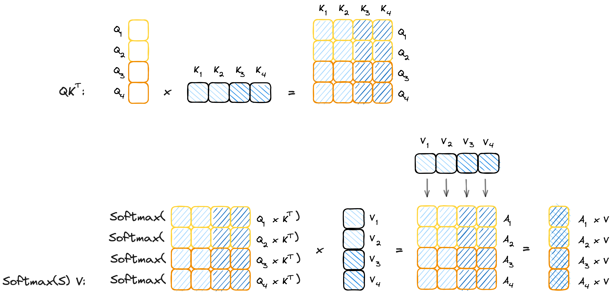

# Ring Flash Attention 研究与实现

## 1. Softmax 及其分段计算
关于 softmax 及 online softmax 的原理、计算方法，可参考笔者之前的文章：
- [ops(2)：SoftMax算子的 CUDA 实现](https://zhuanlan.zhihu.com/p/695307283)
- [LLM（十七）：从 FlashAttention 到 PagedAttention, 如何进一步优化 Attention 性能](https://zhuanlan.zhihu.com/p/638468472)

softmax 分段计算对于 Attention 的实现至关重要，其过程可参见视频 https://x.com/fvsmassa/status/1580229170629849089 .

值得一提的是，在 Flash Attention 的实现中，分段计算是在时间维度进行的，即对每个时间步的 softmax 进行分段计算，以时间换空间。而在 Ring Attention 中，分段计算是在空间维度进行的，即对每个 token 序列的 softmax 在多个device进行分段计算，以空间换时间。

现在我们引入一个新的概念：lse(log sum exp), 即 log(sum(exp(x))) 来推导分段计算的公式。
我们知道为了避免数值溢出，我们计算 softmax 时会减去一个最大值，即 

$$M=max(x)$$

$$softmax(x_i) = \frac{e^{x_i - M}}{\sum_{i=1}^{n} e^{x_i - M}}$$

然后我们引入 lse 技巧

$$lse\left(x_1, x_2, \ldots, x_n\right)=\log \left(\sum_{i=1}^n e^{x_i}\right)=M+\log \left(\sum_{i=1}^n e^{x_i-M}\right)$$

这样就有：
$$softmax(x_i) = e^{x_i-lse} $$
通过这种方式，同时解决了上溢出和下溢出的问题。

logsumexp函数还有一个有趣的性质，对其求导也可以的softmax函数
$$
\frac{\partial}{\partial x_i}\left(\log \left(\sum_{i=1}^n e^{ x_i}\right)\right)=\frac{e^{x_i}}{\sum_{i=1}^n e^{ x_i}}
$$

接下来研究如何进行分段计算，假设对于向量$X$, 将其分为 $n$ 段，即

$$X = [X_1, X_2, \ldots, X_n]$$

然后我们要采用迭代的方法计算 $softmax(X)$, 
对于第一块 $X_1$, 我们只有该部分的信息，因此只能计算该部分的 softmax, 即

$$lse_1 = \log \left(\sum_{i=1}^{len(X_1)} e^{x_i}\right)$$

$$softmax_1(x_i) = e^{x_i-lse_1}$$

然后我们再计算第二块 $lse_2$, 此时应对 $softmax_1$ 进行更新，即

$$ softmax_1^{\prime}(x_i) = \frac{e^{x_i}}{\sum_{i=1}^{len(X_1)} e^{x_i} + \sum_{i=1}^{len(X_2)} e^{x_i}} = \frac{e^{x_i}}{e^{lse_1} + e^{lse_2}} = \frac{e^{x_i}}{e^{lse_1}} \frac{e^{lse_1}}{e^{lse_1} + e^{lse_2}} = softmax_1\frac{1}{1+ e^{lse_2-lse_1}} = softmax_1*sigmoid(lse_1-lse_2)$$

这样我们就找到了递推关系，在实际的计算中，我们只需要保存当前的“全局” $lse$ 和 $softmax$ 值即可

$$lse_{new} = \log (e^{lse} + e^{lse_{block}})$$
$$softmax^\prime = softmax * e^{lse-lse_{new}}$$

## 2. Ring Attention 原理
弄清楚 softmax 的分段计算的过程之后，我们就可以开始研究 Ring Attention 的原理了。

如果我们将 Q 进行拆分，那么需要全部的 K,V 才能实现 softmax 的计算，即：

$$\text{attention}(q_x,K,V)=\frac{\sum_{y=1}^{\text{seqlen}}e^{w_{xy}}v_y}{\sum_{y=1}^{\text{seqlen}}e^{w_{xy}}}$$

其中 $w_{xy}=q_xk_y^T/\sqrt{d}$ 。

计算过程如下图所示：


接下来再对 K,V 进行拆分，我们用 $attn=A/B$ 表示 attention 结果的分子和分母, 对于分子部分，有

$$
\begin{equation}
\begin{aligned}
A_i &= \exp \left(Q_i K^T\right) \cdot V \\
&=\exp \left(\left[Q_i K_1^T, \ldots, Q_i K_{B_{K V}}^T\right]\right) \cdot V \\
&=\left(\left[\exp \left(Q_i K_1^T\right), \ldots, \exp \left(Q_i K_{B_{K V}}^T\right)\right]\right) \cdot V \\
&=\left[\exp \left(Q_i K_1^T\right), \ldots, \exp \left(Q_i K_{B_{K V}}^T\right) \right] \cdot\left[\begin{array}{c}
V_1 \\
\ldots \\
V_{B_{K V}}
\end{array}\right] \\
&=\sum_{j=1}^{B_{K V}} \exp \left(Q_i K_j^T\right) \cdot V_j
\end{aligned}
\end{equation}
$$

则有

$$
\begin{equation}
\frac{A}{B}=\frac{\sum_{i=1}^n A_i}{\sum_{i=1}^n B_i}
\end{equation}
$$

下面通过记录 $attn_i=A_i/B_i$ 和 $B_i$ 来计算完整的 attention 结果。

$$
\begin{aligned} 
B_{12} &= B_1 + B_2 \\ 
\text{attn}_{12} &= \text{attn}_1\frac{B_{1}}{B_{12}}+\text{attn}_2\frac{B_{2}}{B_{12}} \\ 
B_{123} &= B_{12} + B_{3} \\ 
\text{attn}_{123} &= \text{attn}_{12}\frac{B_{12}}{B_{123}}+\text{attn}_3\frac{B_{3}}{B_{123}}\\ &\cdots\\ B_{1\dots n}&=B_{1\dots n-1} + B_{n}\\ 
\text{attn}=\text{attn}_{1\dots n} &= \text{attn}_{1\dots n-1}\frac{B_{1\dots n-1}}{B_{1\dots n}}+\text{attn}_n\frac{B_{n}}{B_{1\dots n}} 
\end{aligned}
$$

接下来用 LSE 来替换 B，即 $LSE_i=log(B_i)$，则

$$
\begin{aligned}
\text{LSE}_{12} &= \log (B_1 + B_2) \\
&= \log(B_1 \times (1 + \frac{B_2}{B_1})) \\
&= \log B_1 + \log(1 + e^{\log B_2 - \log B_1}) \\
&= \text{LSE}_1 + \log(1 + e^{\text{LSE}_2 - \text{LSE}_1})
\end{aligned}
$$

123

$$
\begin{aligned} \text{attn}_{12}&=\text{attn}_1\frac{B_{1}}{B_{12}}+\text{attn}_2\frac{B_{2}}{B_{12}}\\ &=\text{attn}_1 e^{\text{LSE}_{1} - \text{LSE}_{12}}+\text{attn}_2 e^{\text{LSE}_{2} - \text{LSE}_{12}} \end{aligned}
$$


代码实现如下所示：
```
def _update_out_and_lse(
    out: torch.Tensor,
    lse: torch.Tensor,
    block_out: torch.Tensor,
    block_lse: torch.Tensor,
) -> Tuple[torch.Tensor, torch.Tensor]:
    block_out = block_out.to(torch.float32)
    block_lse = block_lse.transpose(-2, -1).unsqueeze(dim=-1)

    new_lse = lse + torch.log(1 + torch.exp(block_lse - lse))
    out = torch.exp(lse - new_lse) * out + torch.exp(block_lse - new_lse) * block_out

    lse = new_lse
    return out, lse
```

事实上还可以进一步简化，即不需要计算出 `new_lse`,推导如下：
$$
\begin{aligned} 
\text{attn}_{12}&=\text{attn}_1 e^{\text{LSE}_{1} - \text{LSE}_{12}}+\text{attn}_2 e^{\text{LSE}_{2} - \text{LSE}_{12}} \\
&=\text{attn}_1 e^{-\log(1+ e^{\text{LSE}_{2} - \text{LSE}_{1}})}+\text{attn}_2 e^{\text{LSE}_{2} - \text{LSE}_{1} - \log(1+ e^{\text{LSE}_{2} - \text{LSE}_{1}})} \\
&=\text{attn}_1 \cdot \frac{1}{1+ e^{\text{LSE}_{2} - \text{LSE}_{1}}}+\text{attn}_2 \cdot \frac{e^{\text{LSE}_{2} - \text{LSE}_{1}}}{1+ e^{\text{LSE}_{2} - \text{LSE}_{1}}} \\
&=\text{attn}_1 \cdot \frac{1}{1+ e^{\text{LSE}_{2} - \text{LSE}_{1}}}+\text{attn}_2 \cdot \frac{1}{1+ e^{-\text{LSE}_{2} + \text{LSE}_{1}}} \\
&=\text{attn}_1 \cdot \text{sigmoid}(\text{LSE}_{2} - \text{LSE}_{1})+\text{attn}_2 \cdot \text{sigmoid}(\text{LSE}_{1} - \text{LSE}_{2}) \\
&= \text{attn}_1 - (\text{attn}_1 - \text{attn}_2) \cdot \text{sigmoid}(\text{LSE}_{1} - \text{LSE}_{2})
\end{aligned}
$$
代码实现如下：
```python
def _update_out_and_lse(out: torch.Tensor, lse: torch.Tensor, block_out: torch.Tensor, block_lse: torch.Tensor,) -> Tuple[torch.Tensor, torch.Tensor]:
    block_out = block_out.to(torch.float32)
    block_lse = block_lse.transpose(-2, -1).unsqueeze(dim=-1)

    out = out - F.sigmoid(block_lse - lse) * (out - block_out)
    lse = lse - F.logsigmoid(lse - block_lse)
    return out, lse
```


## 2. Ring Attention 原理及其实现


### 精度验证


# 参考资料
[1] https://coconut-mode.com/posts/ring-attention/

[2] https://zhuanlan.zhihu.com/p/683714620


