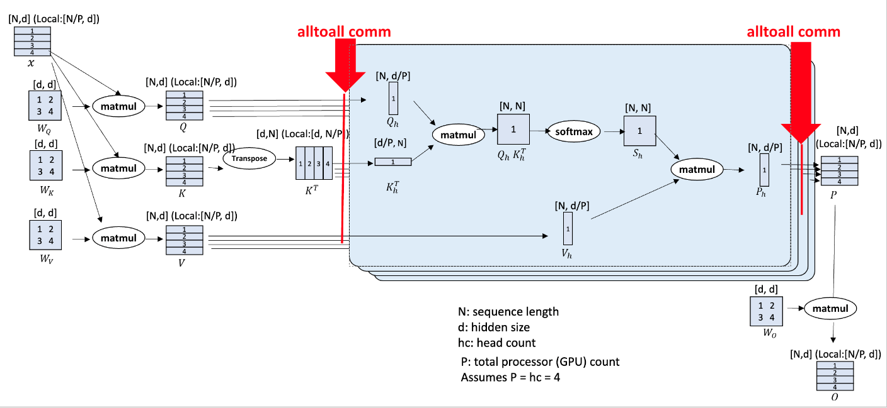
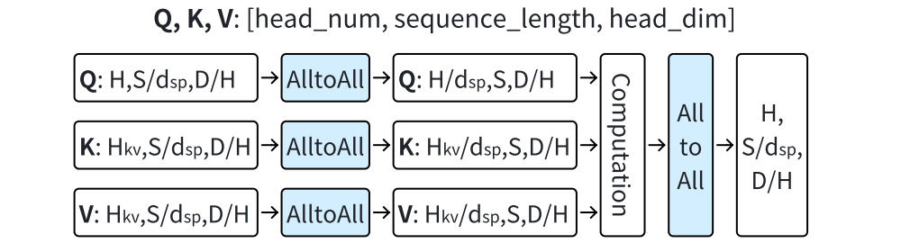

# DeepSpeed-Ulysses 原理与实现

DeepSpeed-Ulysses attention 的原理比较简单，即：
- 输入沿序列维度切分到多个 GPU 上，每个 GPU 只处理序列的一部分
- 在计算 Attention 前，通过 all2all 操作，将序列维度的划分转化到注意力头上，这样每个 GPU 都有完整的序列长度，但只有部分注意力头（类似于TP）
- Attention 计算完成后，再通过 all2all 操作，将注意力头维度的划分转化回序列维度，这样每个 GPU 都有完整的注意力头，但只有部分序列

其原理如下图所示：

当然以上过程也可以简单表示为：

接下来，我们详细解释一下 Ulysses 的实现细节。

# 参考资料
[1] https://github.com/feifeibear/long-context-attention

